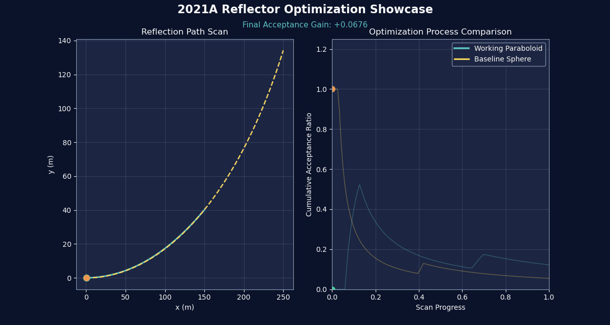

# 2021A 光学反射优化 Showcase

<p align="center">
  
</p>

<p align="center">
  
  
  
</p>

这个目录是对 2021 国赛 A 题相关代码的工程化重构版本，目标是三件事：

1. 在不破坏原始脚本的前提下，提供更快、更稳定、可复现实验流程。
2. 自动生成可直接放在 GitHub 首页/项目页的高质感 GIF 与仪表板图。
3. 给出分层文档，方便答辩、二次开发与团队协作。

## 一键运行

```bash
pip install -r requirements.txt
python run_showcase.py
```

运行后将自动生成：

- 封面 GIF：`outputs/gifs/github_cover.gif`
- 过程 GIF：`outputs/gifs/process_sweep.gif`
- 仪表板：`outputs/images/dashboard.png`
- 指标报告：`outputs/summary.json`

## GitHub 展示建议

在仓库 README 中插入：

```markdown
## 2021A Optical Optimization Showcase


```

## 目录结构

```text
2021A_optimized_showcase/
├─ data/                 # 数据说明、附件放置点
├─ docs/                 # 深度代码阅读与方法文档
├─ notebooks/            # 预留交互式分析入口
├─ outputs/
│  ├─ gifs/              # GitHub 封面与过程动画
│  └─ images/            # 仪表板与静态图
├─ src/
│  ├─ data_loader.py     # 数据发现、兼容读取、回退合成
│  ├─ ray_models.py      # 反射落点计算（向量化/循环）
│  ├─ benchmark.py       # 性能对比
│  ├─ visualization.py   # 高级可视化与 GIF 管线
│  └─ pipeline.py        # 一键入口管线
├─ run_showcase.py       # CLI 启动脚本
└─ requirements.txt
```

## 重构亮点

- 全面向量化：核心计算从逐点循环重写为 NumPy 向量化。
- 可靠读取：自动检测 `附件1.csv`；缺失时自动生成物理合理的节点云。
- 指标闭环：输出接收率提升、速度提升与图形产物。
- 展示友好：所有输出文件均可直接被 GitHub Markdown 引用。

## 原始代码保留策略

原始脚本 (`第三问光线接受比代码.py`, `图像.py`, `main_code(2).m`, `select_best_alteration(2).m`) 未被覆盖，保留在上级目录，便于对照与追溯。
