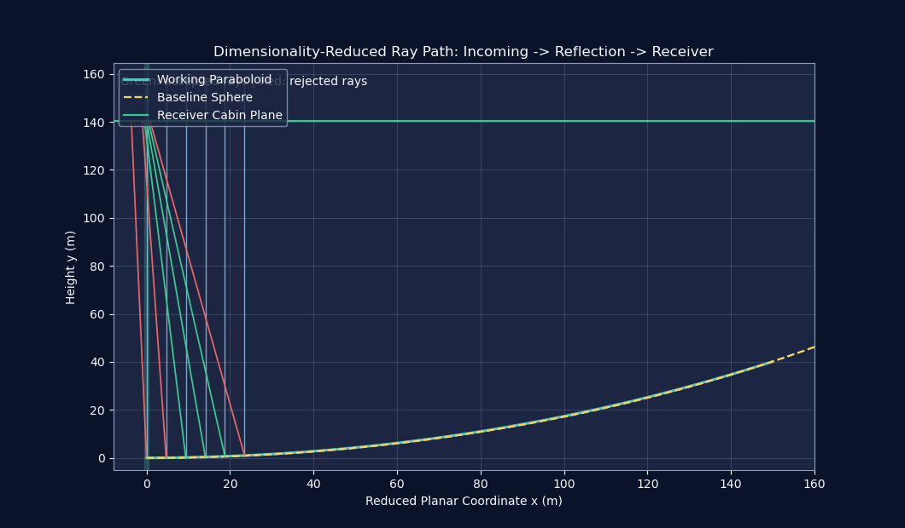

# FAST Reflector Optimization

基于重连续化 + 降维平面化 + 遗传优化的 FAST 反射面调控工程化实现。
核心结论：工作抛物面接收比 12.2094%，相对基准球面提升约 124%。

## Dynamic Showcase

  
  

## Navigation

- 📖 [论文摘要](./paper/README.md)
- 💻 [代码与复现](./code/README.md)
- 📊 [结果可视化](./results/README.md)
- 🔧 [算法原理](./docs/algorithm.md)
- 🎬 [可视化设计说明](./docs/visualization.md)

## Core Scoreboard

| 指标 | 数值 |
|---|---:|
| ✅ 顶点优化伸缩量 | 0.38994 m |
| 📈 工作抛物面接收比 | 12.2094% |
| 📉 基准球面接收比 | 5.4508% |
| ⚡ 相对提升 | 123.99% |

## Algorithm Flow

1. 空间旋转：统一全局索点到局部坐标系。
2. 降维平面化：把 3D 调控问题转为平面剖面优化。
3. 重离散化：按口径和角度离散待优化节点。
4. 遗传优化：搜索节点伸缩量，最小化 RMSE。
5. 插值拟合：把离散伸缩映射为连续控制曲线。
6. 反射验证：计算光线入射-反射-馈源命中率。

## Quick Start

在项目根目录执行：

python code/python/run_showcase.py

运行完成后会自动生成：

- results/images/q2_ga_convergence.png
- results/images/acceptance_comparison.png
- results/images/dashboard.png
- results/animations/surface_morph.gif
- results/animations/ray_path_2d.gif
- results/summary.json

## Repository Structure

FAST-Reflector-Optimization/
- paper/: 论文和摘要文档
- code/: Python 实现与 MATLAB 历史版本归档
- results/: 数据文件、静态图、动画
- docs/: 算法原理与可视化解读
