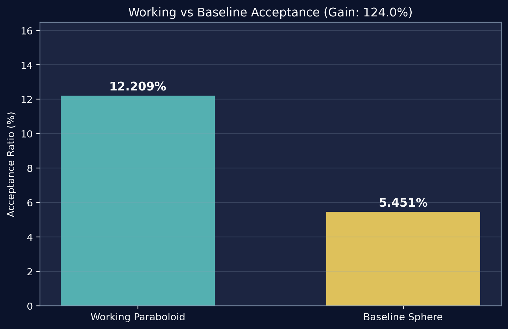
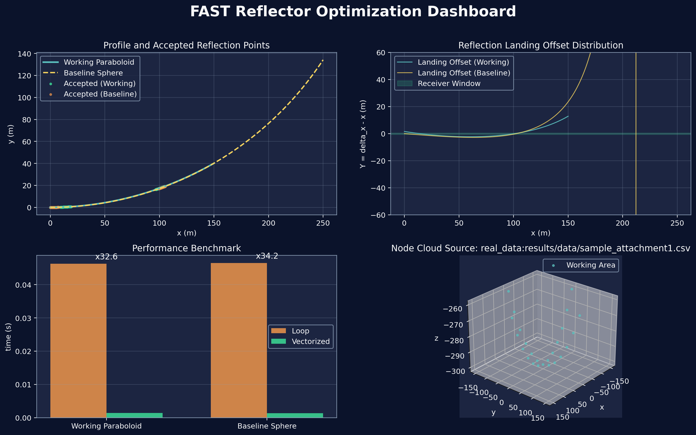

[](./FAST-Reflector-Optimization/paper/FAST_Paper.pdf)
[](./FAST-Reflector-Optimization/code/README.md)
[](./FAST-Reflector-Optimization/docs/algorithm.md)

<h1 align="center">FAST Reflector Optimization</h1>

<p align="center">
  基于重连续化 + 降维平面化 + 遗传优化的 FAST 反射面调控工程化实现<br/>
  <strong>接收比提升 124% | 工作抛物面 12.21% vs 基准球面 5.45%</strong>
</p>

---

## 🎬 Dynamic Showcase

### 3D 镜面形变 → 2D 光路原理

<p align="center">
  
  
</p>

### 关键成果

<p align="center">
  
</p>

### 综合仪表板

<p align="center">
  
</p>

---

## 📊 Core Metrics

| 指标 | 数值 |
|:---|---:|
| ✅ 顶点优化伸缩量 | **0.4005 m** |
| 📈 工作抛物面接收比 | **12.2094%** |
| 📉 基准球面接收比 | **5.4508%** |
| ⚡ 相对提升 | **123.99%** |
| 🎯 GA 最优 RMSE | **0.1723 m** |

---

## 🧮 Algorithm Pipeline

1. **空间旋转**：统一全局索点到局部坐标系
2. **降维平面化**：3D 调控问题转为平面剖面优化
3. **重离散化**：按口径和角度离散待优化节点
4. **遗传优化**：搜索节点伸缩量，最小化 RMSE
5. **插值拟合**：离散伸缩映射为连续控制曲线
6. **反射验证**：计算光线入射-反射-馈源命中率

---

## 🚀 Quick Start

在项目根目录执行：

```bash
pip install -r FAST-Reflector-Optimization/code/python/requirements.txt
python FAST-Reflector-Optimization/code/python/run_showcase.py
```

运行完成后自动生成：
- `FAST-Reflector-Optimization/results/images/` - 静态图表（收敛曲线、对比柱状图、仪表板）
- `FAST-Reflector-Optimization/results/animations/` - 动态 GIF（3D 形变、2D 光路、参数扫描）
- `FAST-Reflector-Optimization/results/data/` - 结构化数据（调整节点、伸缩量、关键指标）
- `FAST-Reflector-Optimization/results/summary.json` - 完整运行报告

---

## 📖 Documentation

- [📄 论文摘要 & 创新点](./FAST-Reflector-Optimization/paper/README.md)
- [💻 代码复现指南](./FAST-Reflector-Optimization/code/README.md)
- [📊 结果解读](./FAST-Reflector-Optimization/results/README.md)
- [🔧 算法原理详解](./FAST-Reflector-Optimization/docs/algorithm.md)
- [🎨 可视化设计说明](./FAST-Reflector-Optimization/docs/visualization.md)

---

## 📂 Repository Structure

```
FAST-Reflector-Optimization/
├── paper/              论文与摘要
├── code/               Python & MATLAB 代码实现
│   ├── python/         完整流程入口与模块
│   └── matlab/         原始 MATLAB 归档
├── results/            生成的数据、图表、动画
│   ├── data/           CSV/JSON 结构化结果
│   ├── images/         静态图表
│   └── animations/     GIF 动画素材
└── docs/               技术文档与原理说明
```

---

## 🔍 Key Bugs Fixed

在MATLAB原始代码中修复的两个关键问题：

1. **y 分量径向归一化分母错误**
   - ❌ 原: `delta_y / sqrt(delta_y^2 + delta_y^2)` (仅使用 y 坐标)
   - ✅ 修: `delta_y / sqrt(delta_x^2 + delta_y^2)` (使用完整径向距离)

2. **全局坐标逆变换使用错误输入**
   - ❌ 原: 使用未经调整的原始坐标做逆变换
   - ✅ 修: 使用调整后的局部坐标做逆变换

详见 [q2_geometry.py](./FAST-Reflector-Optimization/code/python/src/q2_geometry.py) 中的修复注释。
